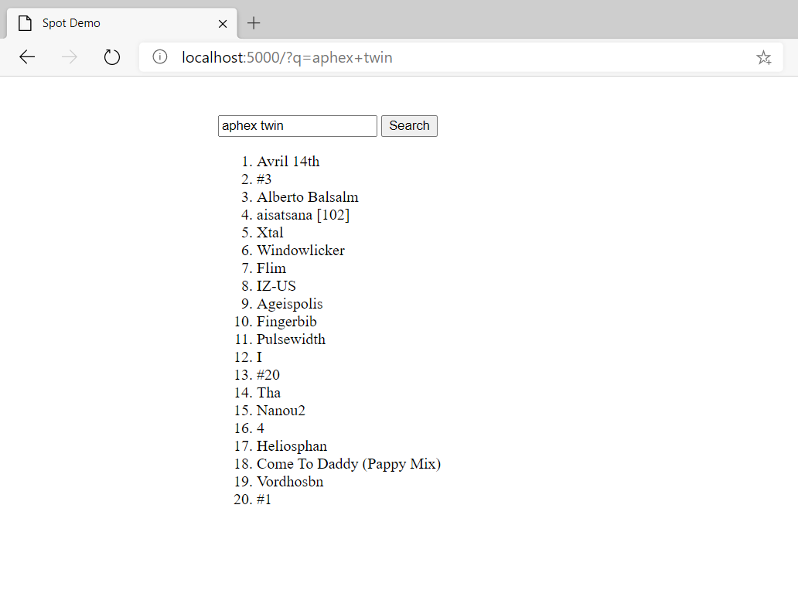

# Spot Demo

Flask app to show top 20 Spotify search results

## Getting started

Install [pipenv](https://docs.python-guide.org/dev/virtualenvs/) and `pipenv install`

Generate and add your [Spotify app credentials](https://developer.spotify.com/documentation/web-api/quick-start/), and add them
to your environment.

    export SPOTIPY_CLIENT_ID=<your ID>
    export SPOTIPY_CLIENT_SECRET=<your secret>
    export FLASK_APP=main.py
  

Finally, `pipenv run flask run` and navigate to http://127.0.0.1:5000

